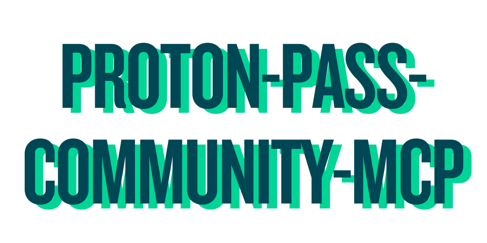

<div align="center"></div>

<br />

`proton-pass-community-mcp` is an MCP server that wraps selected commands from the Proton Pass CLI (`pass-cli`).

It is an independent community project. It is not affiliated with or endorsed by Proton AG.

It is designed as a thin integration layer:

- typed tool inputs with `zod`
- stdio transport for MCP clients

## Available Tools

As this project is in its initial stages, it exposes the following tools:

| Tool                       | Purpose                                          |
| -------------------------- | ------------------------------------------------ |
| `view_session_info`        | Session/account status from `pass-cli info`      |
| `view_user_info`           | User account details from `pass-cli user info`   |
| `check_status`             | Check user authentication status and CLI version |
| `list_vaults`              | List vaults                                      |
| `list_shares`              | List shares                                      |
| `list_invites`             | List pending invitations                         |
| `view_settings`            | View current Proton Pass CLI settings            |
| `list_vault_members`       | List members of a specific vault                 |
| `vault_member_update`      | Update a vault member role                       |
| `vault_member_remove`      | Remove a vault member                            |
| `list_items`               | List vault or share items, omitting contents     |
| `search_items`             | Search items by title                            |
| `view_item`                | View item by URI or selectors                    |
| `create_vault`             | Create a vault                                   |
| `update_vault`             | Update a vault name                              |
| `delete_vault`             | Delete a vault                                   |
| `vault_share`              | Share a vault with a user                        |
| `create_login_item`        | Create a login item                              |
| `update_item`              | Update an item field set                         |
| `delete_item`              | Delete an item                                   |
| `item_share`               | Share an item with a user                        |
| `item_totp`                | Generate item TOTP codes                         |
| `generate_random_password` | Generate a random password                       |
| `generate_passphrase`      | Generate a passphrase                            |
| `score_password`           | Score password strength                          |

The `search_items` operation is additional functionality that is not provided by the base CLI.

Mutative tools require write gate opt-in (`ALLOW_WRITE=1`) and explicit per-call confirmation (`confirm: true`).

## Item Discovery Contract

`list_items` and `search_items` return token-efficient results. These operations do not contain the full contents or secrets of any items, thus preventing unnecessary leakage of sensitive data from the CLI to the host application or the LLM.

`list_items` and `search_items` both support MCP pagination:

- Input fields:
  - `pageSize` (optional, `1..250`, default `100` for JSON output)
  - `cursor` (optional non-negative integer string offset, for example `"100"`)
- Behavior:
  - Response includes `items`, `pageSize`, `cursor`, `returned`, `total`, and `nextCursor`.
  - Use `nextCursor` in a follow-up call to fetch the next page.

`list_items` also forwards `filterType`, `filterState`, and `sortBy` to `pass-cli item list`.

`search_items` semantics:

- title-only search (`field: "title"`)
- matching modes: `contains`, `prefix`, `exact`
- optional `caseSensitive`

## Requirements

> [!NOTE]
> Currently, the server expects the user to handle authentication. If it's not able to authenticate, it will simply prompt the user to authenticate using one of the `pass-cli` methods.

- Node.js `24` (`.nvmrc`)
- `pass-cli` installed and authenticated
- MCP client capable of stdio transport

### 📌 Current Baseline Version of `pass-cli` used in development: v1.5.2

## Run Locally

```bash
npm ci
npm run build
npm run dev
```

## MCP Client Configuration

Example MCP server config using command-line args:

```json
{
  "mcpServers": {
    "proton-pass-community-mcp": {
      "command": "node",
      "args": ["/absolute/path/to/proton-pass-community-mcp/dist/index.js", "--allow-version-drift"]
    }
  }
}
```

Example MCP server config using environment overrides:

```json
{
  "mcpServers": {
    "proton-pass": {
      "command": "node",
      "args": ["/absolute/path/to/proton-pass-community-mcp/dist/index.js"],
      "env": {
        "PASS_CLI_BIN": "pass-cli",
        "PASS_CLI_ALLOW_VERSION_DRIFT": "true"
      }
    }
  }
}
```

## Authentication Model

1. Authentication is user-managed outside MCP with `pass-cli login`.
2. On auth failure, tools return standardized `AUTH_*` errors and a retry instruction.
3. The MCP server does not collect credentials, OTP codes, or private keys.
4. Use `check_status` once as a session preflight (not per tool call); rely on `AUTH_*` fallback errors if the session later expires.
5. `check_status` compares your local CLI version against the development baseline and reports a version assessment for LLMs:
   - `equal`: exact semver match
   - `compatible`: semver differs but appears compatible by policy
   - `possibly_incompatible`: semver indicates potential drift, or version parsing/execution prevented a strict comparison
6. Version assessments are advisory. `check_status` is marked as an MCP error only when connectivity/authentication fails.
7. There is no MCP-specific API token auth layer in this server. Authentication methods are those supported by `pass-cli` in the server process environment.

### Test Account Workflow

For disposable test-account usage in local development and CI (including account preflight checks and session isolation), see [docs/testing/TEST_ACCOUNT_WORKFLOW.md](./docs/testing/TEST_ACCOUNT_WORKFLOW.md).

## Startup Flags

- `--allow-version-drift`: treat semver mismatch/version-parse uncertainty as compatible for `check_status`

Equivalent environment variable:

- `PASS_CLI_ALLOW_VERSION_DRIFT=true|false` (accepted truthy values: `true`, `1`, `yes`, `on`; falsy: `false`, `0`, `no`, `off`)
- If both are set, the CLI flag takes precedence.

Example:

```bash
npm run dev -- --allow-version-drift
```

## Notes

- This is not an official Proton project.
- This project currently targets Proton Pass via `pass-cli` only.
- See [ROADMAP.md](./ROADMAP.md) for planned features.
- In addition to the MCP server, there is an agent [skill file](./skills/pass-cli-mcp/SKILL.md) that is intended to be integrated with this MCP - however, it is currently only a draft.
- Developer runtime configuration and validation workflows are documented in [CONTRIBUTING.md](./CONTRIBUTING.md).
- Disposable account setup and contributor/CI guidance are documented in [docs/testing/TEST_ACCOUNT_WORKFLOW.md](./docs/testing/TEST_ACCOUNT_WORKFLOW.md).
- See [CONTRIBUTING.md](./CONTRIBUTING.md) if you're interested in contributing to this project. Contributors are highly welcome at this stage.

LICENSE

GPL-3 &copy; 2026 Really Him
