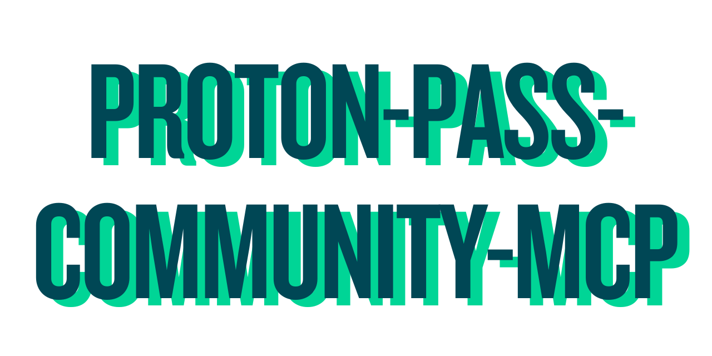

<div align="center"></div>

<br />

[](https://github.com/hesreallyhim/proton-pass-community-mcp/actions/workflows/ci.yml)
[](https://github.com/hesreallyhim/proton-pass-community-mcp/actions/workflows/production-hygiene.yml)


`proton-pass-community-mcp` is an MCP server for Proton Pass, with broad coverage of `pass-cli` operations.

It is an independent community project. It is not affiliated with or endorsed by Proton AG.

It is designed as a production-ready integration layer:

- typed tool inputs with `zod`
- stdio transport for MCP clients

### 📌 Current Version of `pass-cli` used in development: v1.10.0

## Available Tools

The server exposes the following MCP tool surface:

| Tool                              | Purpose                                          |
| --------------------------------- | ------------------------------------------------ |
| `view_session_info`               | Session/account status from `pass-cli info`      |
| `view_user_info`                  | User account details from `pass-cli user info`   |
| `check_status`                    | Check user authentication status and CLI version |
| `inject`                          | Inject secrets into template files               |
| `run`                             | Run commands with secret references resolved     |
| `list_vaults`                     | List vaults                                      |
| `list_shares`                     | List shares                                      |
| `list_invites`                    | List pending invitations                         |
| `accept_invite`                   | Accept an invitation token                       |
| `reject_invite`                   | Reject an invitation token                       |
| `view_settings`                   | View current Proton Pass CLI settings            |
| `list_vault_members`              | List members of a specific vault                 |
| `update_vault_member`             | Update a vault member role                       |
| `remove_vault_member`             | Remove a vault member                            |
| `list_items`                      | List vault or share items, omitting contents     |
| `search_items`                    | Search items by title                            |
| `view_item`                       | View item by URI or selectors                    |
| `create_vault`                    | Create a vault                                   |
| `update_vault`                    | Update a vault name                              |
| `delete_vault`                    | Delete a vault                                   |
| `share_vault`                     | Share a vault with a user                        |
| `transfer_vault`                  | Transfer vault ownership                         |
| `create_login_item`               | Create a login item                              |
| `create_login_item_from_template` | Create a login item from template payload        |
| `create_note_item`                | Create a note item                               |
| `create_credit_card_item`         | Create a credit card item                        |
| `create_wifi_item`                | Create a WiFi item                               |
| `create_custom_item`              | Create a custom item from template payload       |
| `create_identity_item`            | Create an identity item from template payload    |
| `move_item`                       | Move an item between vaults                      |
| `trash_item`                      | Move an item to trash                            |
| `untrash_item`                    | Restore an item from trash                       |
| `update_item`                     | Update an item field set                         |
| `delete_item`                     | Delete an item                                   |
| `download_item_attachment`        | Download an item attachment                      |
| `list_item_members`               | List members of an item                          |
| `update_item_member`              | Update an item member role                       |
| `remove_item_member`              | Remove an item member                            |
| `create_item_alias`               | Create an alias item                             |
| `share_item`                      | Share an item with a user                        |
| `generate_item_totp`              | Generate item TOTP codes                         |
| `generate_random_password`        | Generate a random password                       |
| `generate_passphrase`             | Generate a passphrase                            |
| `generate_totp`                   | Generate TOTP from secret/URI                    |
| `score_password`                  | Score password strength                          |

Coverage goal: provide comprehensive support for Proton Pass CLI workflows that fit MCP tool semantics.
Intentionally excluded are CLI behaviors that are purely interactive or otherwise not a good fit for reliable MCP tool execution.

The `search_items` operation is additional functionality that is not provided by the base CLI.

Mutative tools currently require write gate opt-in (`ALLOW_WRITE=1`) and explicit per-call confirmation (`confirm: true`).

Proposed protocol-aligned confirmation policy (elicitation-first with fail-closed fallback) is documented in [docs/TOOL_SCHEMA_PLAN.md](./docs/TOOL_SCHEMA_PLAN.md#write-authorization-and-confirmation-policy-proposal).

## Available Resources

The server also exposes static MCP resources for item-create template snapshots:

- `pass://templates/item-create` (catalog/index)
- `pass://templates/item-create/login`
- `pass://templates/item-create/note`
- `pass://templates/item-create/credit-card`
- `pass://templates/item-create/wifi`
- `pass://templates/item-create/custom`
- `pass://templates/item-create/identity`

Snapshot artifact source:

- [docs/testing/item-create-templates.snapshot.json](./docs/testing/item-create-templates.snapshot.json)

These template resources are example well-formed payloads from `pass-cli --get-template`, not authoritative validation schemas.

## Item Discovery Contract

`list_items` and `search_items` return token-efficient results. These operations do not contain the full contents or secrets of any items, thus preventing unnecessary leakage of sensitive data from the CLI to the host application or the LLM.

`list_items` and `search_items` both support MCP pagination:

- Input fields:
  - `pageSize` (optional, `1..250`, default `100` for JSON output)
  - `cursor` (optional non-negative integer string offset, for example `"100"`)
- Behavior:
  - Response includes `items`, `pageSize`, `cursor`, `returned`, `total`, and `nextCursor`.
  - Use `nextCursor` in a follow-up call to fetch the next page.

`list_items` also forwards `filterType`, `filterState`, and `sortBy` to `pass-cli item list`.

`search_items` semantics:

- title-only search (`field: "title"`)
- matching modes: `contains`, `prefix`, `exact`
- optional `caseSensitive`

## Requirements

> [!NOTE]
> Currently, the server expects the user to handle authentication. If it's not able to authenticate, it will simply prompt the user to authenticate using one of the `pass-cli` methods.

- Node.js `24` (`.nvmrc`)
- `pass-cli` installed and authenticated
- MCP client capable of stdio transport
- For project development and testing, use the repo wrapper (`npm run pass -- <args>` or `scripts/pass-dev.sh <args>`) instead of bare `pass-cli` so auth stays in the repo-local session scope.

## Run Locally

```bash
npm ci
npm run build
npm run dev
```

For project-side `pass-cli` work, prefer:

```bash
npm run pass -- info
```

This routes through the repo wrapper, which uses a project-local session dir and avoids OS keychain/keyring by default. To assert that the active repo-local session is the intended throwaway account before mutative work:

```bash
export PASS_DEV_EXPECTED_ACCOUNT=<throwaway-account-identifier>
npm run pass:dev:preflight
```

## Install and Run via npm/npx

Install from npm or run directly with `npx`:

```bash
npm install --global proton-pass-community-mcp
proton-pass-community-mcp --allow-version-drift
```

or:

```bash
npx -y proton-pass-community-mcp --allow-version-drift
```

Release operations for maintainers are documented in [docs/DEPLOYMENT.md](./docs/DEPLOYMENT.md).

## Anonymized Demo Shell (Docker)

Use this when recording demos and you want a neutral workspace path in tooling metadata:

```bash
npm run demo:shell
```

This launches a container with the project mounted at `/workspace/project`.

To run a single command instead of an interactive shell:

```bash
npm run demo:shell -- npm run check
```

Notes:

- Shell prompt aliases/PS1 tweaks only change terminal display; they do not change real working-directory metadata emitted by tools.
- For true path anonymization in logs, run the host/tooling process from inside this containerized workspace.

## MCP Client Configuration

Example MCP server config using `npx` package execution:

```json
{
  "mcpServers": {
    "proton-pass-community-mcp": {
      "command": "npx",
      "args": ["-y", "proton-pass-community-mcp", "--allow-version-drift"]
    }
  }
}
```

If you are developing locally from source, use a direct local build path:

Example MCP server config using command-line args:

```json
{
  "mcpServers": {
    "proton-pass-community-mcp": {
      "command": "node",
      "args": ["/absolute/path/to/proton-pass-community-mcp/dist/index.js", "--allow-version-drift"]
    }
  }
}
```

Example MCP server config using environment overrides:

```json
{
  "mcpServers": {
    "proton-pass": {
      "command": "node",
      "args": ["/absolute/path/to/proton-pass-community-mcp/dist/index.js"],
      "env": {
        "PASS_CLI_BIN": "pass-cli",
        "PASS_CLI_ALLOW_VERSION_DRIFT": "true"
      }
    }
  }
}
```

## Authentication Model

1. Authentication is user-managed outside MCP with `pass-cli login`.
2. The `pass-cli` session may be established with normal account credentials or with a pre-provisioned personal access token (PAT).
3. On auth failure, tools return standardized `AUTH_*` errors and a retry instruction.
4. The MCP server does not collect credentials, OTP codes, private keys, or PAT values.
5. PAT-backed login does not change the boundary: login/logout remain outside MCP, and PAT provisioning is not currently exposed as an MCP tool surface.
6. For project development, the canonical `pass-cli` entrypoint is the repo wrapper (`npm run pass -- <args>` / `scripts/pass-dev.sh <args>`), not bare `pass-cli`.
7. The repo wrapper isolates project auth into `.tmp/proton-pass-dev-session` and avoids default keychain/keyring access, but it does not by itself prove the correct account is active; use `scripts/pass-dev-preflight.sh` or `npm run pass:dev:preflight` to assert the expected throwaway account.
8. Use `check_status` once as a session preflight (not per tool call); rely on `AUTH_*` fallback errors if the session later expires.
9. `check_status` compares your local CLI version against the development baseline and reports a version assessment for LLMs:
   - `equal`: exact semver match
   - `compatible`: semver differs but appears compatible by policy
   - `possibly_incompatible`: semver indicates potential drift, or version parsing/execution prevented a strict comparison
10. Version assessments are advisory. `check_status` is marked as an MCP error only when connectivity/authentication fails.
11. There is no MCP-specific API token auth layer in this server. Authentication methods are those supported by `pass-cli` in the server process environment.

### Test Account Workflow

For disposable test-account usage in local development and CI (including account preflight checks and session isolation), see [docs/testing/TEST_ACCOUNT_WORKFLOW.md](./docs/testing/TEST_ACCOUNT_WORKFLOW.md).

## Startup Flags

- `--allow-version-drift`: treat semver mismatch/version-parse uncertainty as compatible for `check_status`

Equivalent environment variable:

- `PASS_CLI_ALLOW_VERSION_DRIFT=true|false` (accepted truthy values: `true`, `1`, `yes`, `on`; falsy: `false`, `0`, `no`, `off`)
- If both are set, the CLI flag takes precedence.

Example:

```bash
npm run dev -- --allow-version-drift
```

## Notes

- This is not an official Proton project.
- This project currently targets Proton Pass via `pass-cli` only.
- See [ROADMAP.md](./ROADMAP.md) for planned features.
- In addition to the MCP server, there is an agent [skill file](./skills/pass-cli-mcp/SKILL.md) that is intended to be integrated with this MCP - however, it is currently only a draft.
- Developer runtime configuration and validation workflows are documented in [CONTRIBUTING.md](./CONTRIBUTING.md).
- Disposable account setup and contributor/CI guidance are documented in [docs/testing/TEST_ACCOUNT_WORKFLOW.md](./docs/testing/TEST_ACCOUNT_WORKFLOW.md).
- See [CONTRIBUTING.md](./CONTRIBUTING.md) if you're interested in contributing to this project. Contributors are welcome.

LICENSE

GPL-3 &copy; 2026 Really Him
