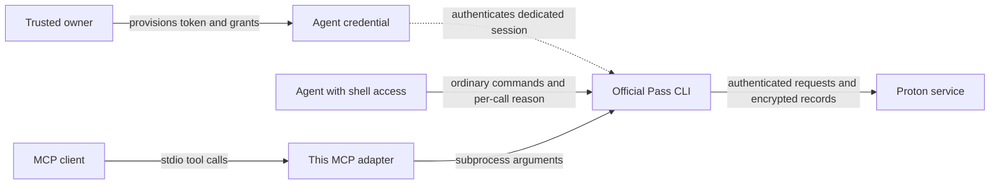

# Proton Pass CLI `agent` and the future of this MCP server

Date: August 27, 2026. This is a research recommendation, not an adopted project policy or an announcement of a status change.

## Recommendation

**Choose (b): put broad development on hold. Preserve the repository while deciding whether a smaller MCP adapter has an actual user and a maintainer.** I would not archive because Proton released its source or added `agent`, and I would not resume the existing broad CLI-parity roadmap merely because an MCP interface remains technically possible.

The distinction that matters is straightforward: **Proton's `agent` feature manages scoped credentials, session behavior, and access records. This project translates MCP tool calls into CLI commands.** The two can work together. But a coding agent with terminal access can now follow Proton's own instructions and use those credentials directly, bypassing the wrapper. That substantially weakens the case for maintaining dozens of duplicated command contracts. An MCP client without a general shell tool remains a credible audience.

There is also a maintenance reason to pause: the current package has a reproduced startup defect, upstream output is already being misinterpreted, and the adapter lacks a per-call reason for agent sessions. Dependency updates alone do not restore compatibility. Conversely, an external user's issue and proposed packaging fix are evidence against assuming nobody cares. The sensible next decision is whether to support that narrower audience, not whether the word `agent` has made MCP obsolete.

Before leaving the project on hold, I would resolve the known distribution failure or clearly warn prospective users that the published package is broken. That is a separate follow-up, not work performed by this report.

## 1. Scope, versions, and confidence

| Evidence                | Snapshot reviewed                                                                                                                                                               |
| ----------------------- | ------------------------------------------------------------------------------------------------------------------------------------------------------------------------------- |
| Upstream source         | `protonpass/pass-cli`, tag `2.3.3`, commit `51a4c9b110a0ffe6e81f4f5d3877b9e5a0c24112`                                                                                           |
| Latest upstream release | `2.3.3`, published August 25, 2026                                                                                                                                              |
| Local MCP source        | Commit `93e80e7c825250ff1d8303e3154238404b1de139`, after the dependency review                                                                                                  |
| Published MCP package   | npm `proton-pass-community-mcp@1.1.2`, published May 7, 2026                                                                                                                    |
| Other evidence          | Official documentation, downloadable agent instructions, release history, contribution policy, GitHub issue/PR history and repository metadata, npm metadata and download count |

The upstream changelog dates agent mode to `2.1.0` on May 20 and source publication to `2.1.2` on May 29. These are separate developments; the repository existed before the implementation became public. [Upstream changelog](https://github.com/protonpass/pass-cli/blob/51a4c9b110a0ffe6e81f4f5d3877b9e5a0c24112/CHANGELOG.md), [latest release](https://github.com/protonpass/pass-cli/releases/tag/2.3.3).

This review inspected code and performed three isolated Node/package probes. **No Proton CLI command was executed, no vault was accessed, and no Rust build or upstream test suite was run.** Source observations establish client behavior, not production backend guarantees. The recommendation has stronger evidence about technical overlap and current defects than about the size of the audience.

## 2. What `pass-cli agent` actually does

### A credential identity for an external agent

An agent is represented as a personal access token with the `PassAgent` flag. Creation produces a credential containing a bearer token and encryption key, formatted `pst_…::key`. There is no model, reasoning loop, task scheduler, tool server, or agent process launched by these commands. The AI application is supplied separately. [Creation implementation](https://github.com/protonpass/pass-cli/blob/51a4c9b110a0ffe6e81f4f5d3877b9e5a0c24112/pass/src/personal_access_token/create.rs#L134), [agent commands](https://github.com/protonpass/pass-cli/blob/51a4c9b110a0ffe6e81f4f5d3877b9e5a0c24112/pass-cli/src/commands/agent/mod.rs#L79).

| Command                            | Behavior at this revision                                                                                                                              |
| ---------------------------------- | ------------------------------------------------------------------------------------------------------------------------------------------------------ |
| `agent create NAME --expiration …` | Creates the flagged token; optional repeated `--vault` arguments grant Viewer access; emits JSON containing `token` and downloaded `instruction` text. |
| `agent list`                       | Lists agent-token metadata, excluding the token's encryption key from serialization.                                                                   |
| `agent delete NAME`                | Resolves an agent by name and calls token deletion.                                                                                                    |
| `agent renew NAME --expiration …`  | Requests a replacement bearer token while retaining the token's encryption key. JSON is the default; human output prints the credential alone.         |
| `agent access grant` / `revoke`    | Grants vault or individual-item access, or revokes a share grant.                                                                                      |
| `agent monitor [NAME]`             | Retrieves records and decrypts their payloads. Account owners select an agent; agent/PAT sessions select their own token ID. Default limit: 100.       |
| `agent instructions`               | Downloads Markdown instructions from Proton. It currently requires an authenticated session.                                                           |

There is no `agent rename`, `agent item`, or `agent access list` command in the inspected command tree. The ordinary `item`, `vault`, `run`, and `inject` commands do the subsequent work. [Command dispatch](https://github.com/protonpass/pass-cli/blob/51a4c9b110a0ffe6e81f4f5d3877b9e5a0c24112/pass-cli/src/commands/agent/mod.rs#L79), [monitor selection](https://github.com/protonpass/pass-cli/blob/51a4c9b110a0ffe6e81f4f5d3877b9e5a0c24112/pass-cli/src/commands/agent/monitor.rs#L90), [renewal](https://github.com/protonpass/pass-cli/blob/51a4c9b110a0ffe6e81f4f5d3877b9e5a0c24112/pass-cli/src/commands/agent/renew.rs#L35).

### Lifecycle and session identity

The intended flow is: a trusted account owner provisions a token and its grants; an external agent authenticates with that token; the agent uses ordinary CLI commands; the owner inspects activity or revokes access. Token expiration choices range from one hour to one year. The documentation separately describes agent **sessions** as lasting two hours, without session locking. The two-hour value is a documented service behavior, not a locally enforced constant established by this review. [Agent session documentation](https://github.com/protonpass/pass-cli/blob/51a4c9b110a0ffe6e81f4f5d3877b9e5a0c24112/docs/public/docs/commands/agent.md#L3), [authentication response](https://github.com/protonpass/pass-cli/blob/51a4c9b110a0ffe6e81f4f5d3877b9e5a0c24112/pass-auth/src/personal_access_token.rs#L39).

**Setting `PROTON_PASS_PERSONAL_ACCESS_TOKEN` does not switch an existing session.** The variable is consumed by `login`; ordinary commands load stored session state. A distinct `PROTON_PASS_SESSION_DIR` must be selected before checking or establishing the agent's session if isolation from the owner's personal session is intended. Authentication and renewal should remain outside this MCP server, consistent with [ADR-005](../ADR/ADR-005-pat-auth-boundary-and-tooling.md). [Login routing](https://github.com/protonpass/pass-cli/blob/51a4c9b110a0ffe6e81f4f5d3877b9e5a0c24112/pass-cli/src/main.rs#L275), [session directory selection](https://github.com/protonpass/pass-cli/blob/51a4c9b110a0ffe6e81f4f5d3877b9e5a0c24112/pass-cli/src/utils.rs#L53).

Proton's launch announcement lists AI access tokens on paid Pass/Proton plans. An integration should not assume that free CLI installation implies access to this feature. The same announcement describes read-only access; that statement needs the implementation qualification below. [Official announcement](https://proton.me/blog/pass-access-tokens).

### Reasons and encrypted activity records

The CLI reads **`PROTON_PASS_AGENT_REASON`**, not a `--reason` flag. It rejects absent or whitespace-only reasons and reasons exceeding 300 Unicode characters. The reason is supplied by the agent; it is not evidence that a human authorized the action or that the stated purpose is truthful. [Reason validation](https://github.com/protonpass/pass-cli/blob/51a4c9b110a0ffe6e81f4f5d3877b9e5a0c24112/pass-cli/src/commands/item/agent_monitor.rs#L25).

Audit payloads contain the reason and optional vault/item names, encrypted with the PAT key. Action and object identifiers accompany that payload; record timestamps come from the service. The code does not deliberately put retrieved passwords or field values in the payload, although names or an incautious reason can themselves contain sensitive material. Logging is a separate request, not an atomic part of the credential operation. [Monitor payload and encryption](https://github.com/protonpass/pass-cli/blob/51a4c9b110a0ffe6e81f4f5d3877b9e5a0c24112/pass/src/monitor.rs#L239), [record metadata](https://github.com/protonpass/pass-cli/blob/51a4c9b110a0ffe6e81f4f5d3877b9e5a0c24112/pass/src/monitor.rs#L66).

| Path                                      | Observed ordering and limit                                                                                                                                                                              |
| ----------------------------------------- | -------------------------------------------------------------------------------------------------------------------------------------------------------------------------------------------------------- |
| Item view and TOTP                        | Fetch/decrypt first, then validate/send the audit before printing the secret. Audit failure prevents normal secret output, not the preceding retrieval.                                                  |
| Item create and move                      | Check the reason before mutation, but send the audit afterward; the mutation can succeed while the command reports failure.                                                                              |
| Item update, trash, untrash; vault update | Mutation precedes reason validation/audit. A missing reason can therefore be reported after a change has happened, if the session has permission to make that change.                                    |
| Item delete                               | Audit precedes deletion; a record does not establish that deletion succeeded.                                                                                                                            |
| Item list                                 | Default output is a metadata summary. Agent sessions reject `--show-secrets`; the underlying client constructs summaries from full contents obtained from its in-process cache or fetched and decrypted. |
| `run` / `inject`                          | Check the reason and audit secret resolution; per-command caches mean repeated references need not generate distinct records.                                                                            |
| Attachment download / alias creation      | These CLI paths do not call the agent-reason helper. Backend auditing was not verified.                                                                                                                  |

Sources: [view](https://github.com/protonpass/pass-cli/blob/51a4c9b110a0ffe6e81f4f5d3877b9e5a0c24112/pass-cli/src/commands/item/view.rs#L98), [TOTP](https://github.com/protonpass/pass-cli/blob/51a4c9b110a0ffe6e81f4f5d3877b9e5a0c24112/pass-cli/src/commands/item/totp.rs#L223), [update](https://github.com/protonpass/pass-cli/blob/51a4c9b110a0ffe6e81f4f5d3877b9e5a0c24112/pass-cli/src/commands/item/update.rs#L88), [delete](https://github.com/protonpass/pass-cli/blob/51a4c9b110a0ffe6e81f4f5d3877b9e5a0c24112/pass-cli/src/commands/item/delete.rs#L25), [list](https://github.com/protonpass/pass-cli/blob/51a4c9b110a0ffe6e81f4f5d3877b9e5a0c24112/pass-cli/src/commands/item/list.rs#L270), [secret resolver](https://github.com/protonpass/pass-cli/blob/51a4c9b110a0ffe6e81f4f5d3877b9e5a0c24112/pass-cli/src/commands/secret_resolver.rs#L220), [attachment download](https://github.com/protonpass/pass-cli/blob/51a4c9b110a0ffe6e81f4f5d3877b9e5a0c24112/pass-cli/src/commands/item/attachment/download.rs#L43).

These records improve visibility into CLI credential access. They do not establish complete downstream activity monitoring, guaranteed audit completeness, or transactionally coupled success records. Revoking a token also cannot make an agent forget a secret it has already received. An adapter must not blindly retry a mutating call merely because the CLI exited unsuccessfully.

### Important qualifications to the advertised model

**Read-only access is not fully resolved by the public client code.** Creation's vault grants are Viewer, but `agent access grant --role` accepts Viewer, Editor, and Manager and forwards the chosen role to the API. The local permission model maps those roles to progressively broader capabilities, while separately prohibiting PAT/agent sessions from token administration, vault creation/deletion, sharing, and invites. Whether the production service rejects or downgrades non-Viewer agent grants is unknown. This is a contract discrepancy to clarify with Proton, not a demonstrated privilege escalation. [Grant arguments](https://github.com/protonpass/pass-cli/blob/51a4c9b110a0ffe6e81f4f5d3877b9e5a0c24112/pass-cli/src/commands/agent/access/mod.rs#L29), [grant request](https://github.com/protonpass/pass-cli/blob/51a4c9b110a0ffe6e81f4f5d3877b9e5a0c24112/pass/src/personal_access_token/grant.rs#L77), [role mapping](https://github.com/protonpass/pass-cli/blob/51a4c9b110a0ffe6e81f4f5d3877b9e5a0c24112/pass-domain/src/models/share/role.rs#L166), [account restrictions](https://github.com/protonpass/pass-cli/blob/51a4c9b110a0ffe6e81f4f5d3877b9e5a0c24112/pass/src/permission/mod.rs#L51).

Agent classification also depends on a PAT-self lookup during login. If that lookup fails, the implementation falls back to ordinary PAT classification, so local agent-specific checks do not run. Backend enforcement may still apply; the source alone does not establish an authorization bypass. [Classification fallback](https://github.com/protonpass/pass-cli/blob/51a4c9b110a0ffe6e81f4f5d3877b9e5a0c24112/pass-auth/src/authenticator.rs#L285).

**Instructions are downloaded content, not a pinned part of the binary.** Create/renew fetch them after changing token state. A download failure can prevent the credential from being printed even though creation or renewal succeeded; creation's sequential grants can also partially succeed. The downloaded Markdown still mentions `pass-cli test`, removed in `2.2.4`, and checks for an existing session before introducing its isolated directory. The command documentation separately contains a nonexistent `agent item view` example and an environment-assignment prefix inside example token JSON that the implementation does not emit. These are reasons to curate and version integration instructions rather than copy them uncritically. [Instruction fetch](https://github.com/protonpass/pass-cli/blob/51a4c9b110a0ffe6e81f4f5d3877b9e5a0c24112/pass-cli/src/commands/agent/mod.rs#L31), [creation sequence](https://github.com/protonpass/pass-cli/blob/51a4c9b110a0ffe6e81f4f5d3877b9e5a0c24112/pass-cli/src/commands/agent/create.rs#L33), [downloaded instructions](https://proton.me/download/pass/agent-data/agent-instructions.md), [documentation examples](https://github.com/protonpass/pass-cli/blob/51a4c9b110a0ffe6e81f4f5d3877b9e5a0c24112/docs/public/docs/commands/agent.md#L44).

Finally, `run` is not a secret sandbox. Child processes inherit environment variables, including an exported PAT; output masking covers selected secret substitutions, not arbitrary credentials or transformations. `inject` deliberately writes plaintext. Neither facility guarantees that a model or downstream program cannot see a secret. [Environment handling and masking](https://github.com/protonpass/pass-cli/blob/51a4c9b110a0ffe6e81f4f5d3877b9e5a0c24112/pass-cli/src/commands/run.rs#L112), [child launch](https://github.com/protonpass/pass-cli/blob/51a4c9b110a0ffe6e81f4f5d3877b9e5a0c24112/pass-cli/src/commands/run.rs#L349).

## 3. Where it overlaps with MCP—and where it does not

The MCP route still needs the upstream credential/session layer. At present the adapter also needs changes to supply a contextual reason. **MCP is a transport and tool interface here; it is not the credential authorization mechanism.**

| Capability                                             | Official CLI with agent credentials                                | This MCP server                                                 | Assessment                                                                           |
| ------------------------------------------------------ | ------------------------------------------------------------------ | --------------------------------------------------------------- | ------------------------------------------------------------------------------------ |
| Scoped credentials, expiry, revocation, access records | Native feature                                                     | Delegates authentication; does not implement these controls     | Use upstream rather than duplicate it.                                               |
| Direct use by terminal-capable agents                  | Commands plus vendor instructions                                  | Optional extra layer                                            | Largest area of practical substitution.                                              |
| MCP discovery, schemas, stdio invocation               | No implementation found in this snapshot                           | 47 registered tools and Zod schemas                             | The clearest remaining reason to exist.                                              |
| Secret-content-free list output                        | Default metadata summaries; agents cannot request `--show-secrets` | Reference projection                                            | Much less distinctive now. Titles and other metadata can still be sensitive.         |
| Title search and result pagination                     | No equivalent to this adapter's combined interface found           | Contains/prefix/exact matching, case control, offset pagination | Useful convenience, but each page still fetches the full CLI list.                   |
| Template resources                                     | CLI template commands                                              | Six discoverable static examples                                | MCP convenience, not authoritative or current schemas.                               |
| Confirmation and write limits                          | Credential roles plus operation restrictions                       | Global `ALLOW_WRITE=1` and `confirm: true` checks               | Default-deny is useful; a model-supplied boolean is not authenticated human consent. |
| Keeping secrets out of model context                   | Depends on command and host                                        | Explicit reads and raw command results can expose secrets       | Neither layer supplies that blanket guarantee.                                       |

Local evidence: [server setup](../../src/server.ts), [list/search handlers](../../src/tools/item/handlers-list.ts), [pagination](../../src/tools/shared/pagination.ts), [template resources](../../src/resources/item-create-templates.ts), [write gate](../../src/tools/shared/write-gate.ts), [run/inject tools](../../src/tools/contents.ts). Upstream evidence: [summary shape](https://github.com/protonpass/pass-cli/blob/51a4c9b110a0ffe6e81f4f5d3877b9e5a0c24112/pass-cli/src/commands/item/list.rs#L62), [top-level command inventory](https://github.com/protonpass/pass-cli/blob/51a4c9b110a0ffe6e81f4f5d3877b9e5a0c24112/pass-cli/src/main.rs#L58).

The full upstream tree, dependency lockfile, official CLI documentation, and reviewed product pages yielded no native MCP server or explicit commitment to build one. Proton's blog mentioning MCP as an agent interface is not an announcement of a Proton MCP product. This finding is limited to public material reviewed on this date, not a prediction of unpublished plans.

**Current agent-session compatibility is incomplete.** The runner accepts arguments and optional stdin, then inherits `process.env`; the schemas offer no per-call reason. An agent session may be reused, but operations requiring a reason will lack one unless the server was launched with a reason already set. A constant launch-wide reason would satisfy a mechanical check while losing useful action context. A future implementation should pass an invocation-specific environment to the child, not mutate shared `process.env` across concurrent requests. [Runner](../../src/pass-cli/runner.ts).

## 4. What open sourcing changes

The seven-crate Rust workspace separates the CLI, domain operations, authentication, shared models/providers, encrypted database, filesystem, and PGP adapters. The `pass` crate exposes `PassClient` and operation types. This makes output formats, permission checks, cryptographic handling, and tests inspectable instead of requiring inference from help text. [Workspace](https://github.com/protonpass/pass-cli/blob/51a4c9b110a0ffe6e81f4f5d3877b9e5a0c24112/Cargo.toml#L1), [library exports](https://github.com/protonpass/pass-cli/blob/51a4c9b110a0ffe6e81f4f5d3877b9e5a0c24112/pass/src/lib.rs#L63).

**It does not provide a ready Node SDK.** `PassClient` needs Proton's transport/SDK and providers for keys, crypto, filesystem, storage, telemetry, and invalidation. The CLI supplies keyring handling and encrypted local persistence. Although the library declares `cdylib` and `rlib` outputs, no C/Node/FFI binding layer was found. Bypassing the CLI would require a binding/helper or rewrite and would move more authentication and cryptographic responsibility into this project. [Client constructor](https://github.com/protonpass/pass-cli/blob/51a4c9b110a0ffe6e81f4f5d3877b9e5a0c24112/pass/src/client.rs#L35), [provider interface](https://github.com/protonpass/pass-cli/blob/51a4c9b110a0ffe6e81f4f5d3877b9e5a0c24112/pass-domain/src/features/client_features.rs#L20), [CLI integration](https://github.com/protonpass/pass-cli/blob/51a4c9b110a0ffe6e81f4f5d3877b9e5a0c24112/pass-cli/src/features/mod.rs#L63), [crate output types](https://github.com/protonpass/pass-cli/blob/51a4c9b110a0ffe6e81f4f5d3877b9e5a0c24112/pass/Cargo.toml#L7).

Build instructions and extensive test source are positive signs, but build reproducibility and test results were not verified. Dependencies include Proton's custom Cargo registry, a Git dependency, and native SQLCipher/OpenSSL/keyring components. The registry was not established to be private or inaccessible. Only a documentation workflow is visible in the inspected public workflow directory; internal CI may exist. [Build instructions](https://github.com/protonpass/pass-cli/blob/51a4c9b110a0ffe6e81f4f5d3877b9e5a0c24112/README.md#L9), [registry configuration](https://github.com/protonpass/pass-cli/blob/51a4c9b110a0ffe6e81f4f5d3877b9e5a0c24112/.cargo/config.toml), [database dependencies](https://github.com/protonpass/pass-cli/blob/51a4c9b110a0ffe6e81f4f5d3877b9e5a0c24112/pass-db/Cargo.toml#L9), [test helpers](https://github.com/protonpass/pass-cli/blob/51a4c9b110a0ffe6e81f4f5d3877b9e5a0c24112/pass/src/test_tools/helpers.rs#L79).

The contribution policy is especially relevant: Proton publishes this repository for transparency and currently declines external patches and feature requests. An upstream merger of this project's MCP work is therefore not a realistic assumption for a plan. [Contribution policy](https://github.com/protonpass/pass-cli/blob/51a4c9b110a0ffe6e81f4f5d3877b9e5a0c24112/CONTRIBUTING.md#L5).

My architectural recommendation, if maintenance resumes, is to **keep the official CLI boundary and narrow the adapter**. Source access makes maintaining that boundary easier to verify. It does not justify taking ownership of Proton's authentication and encryption internals.

## 5. The current project's maintenance position

These are not all caused by the new agent feature. They show what would need attention before claiming compatibility with current upstream versions.

| Finding                                                                                                                                     | Evidence level                                                                          | Consequence                                                                                                                                                               |
| ------------------------------------------------------------------------------------------------------------------------------------------- | --------------------------------------------------------------------------------------- | ------------------------------------------------------------------------------------------------------------------------------------------------------------------------- |
| Published package omits `docs/testing/item-create-templates.snapshot.json`, required eagerly by `createServer()`                            | Reproduced from npm `1.1.2` tarball; integrity verified; `ENOENT`, zero CLI invocations | Normal package startup is broken. Existing issue #130 and PR #131 already identify it.                                                                                    |
| `extractItemType` only reads `content.content`, whereas current upstream summaries use top-level `item_type`                                | Reproduced with a synthetic upstream-shaped summary                                     | `item_type: "login"` yields `type: null`. This is direct contract drift.                                                                                                  |
| Runner passes `input` to asynchronous `execFile`, without writing to child stdin                                                            | Reproduced with a Node child fixture and a positive control                             | The fixture received 0 of 24 bytes through this runner, versus 24 with an explicit stdin write. Template creation's intended input is not delivered.                      |
| No contextual `PROTON_PASS_AGENT_REASON`                                                                                                    | Static inspection                                                                       | Agent-token integration is incomplete, even though inherited authentication can work.                                                                                     |
| Reference-only discovery returns raw output on parse/shape failure; `output: "human"` bypasses projection despite runner JSON normalization | Static inspection                                                                       | Older full-content CLI responses can bypass the intended disclosure boundary. Latest upstream summaries reduce the ordinary exposure but do not fix the adapter contract. |
| Inspector smoke script still expects eight tools from v0.1                                                                                  | Static inspection                                                                       | It is not a current end-to-end acceptance check for the 47-tool interface.                                                                                                |
| Runtime compatibility baseline `1.9.0`, tracked upstream `2.2.0`, template snapshot `1.6.1`                                                 | Static inspection                                                                       | Version metadata and fixtures do not establish compatibility with `2.3.3`.                                                                                                |

Sources: [package manifest](../../package.json), [resource loader](../../src/resources/item-create-templates.ts), [type extraction](../../src/tools/shared/item-utils.ts), [runner](../../src/pass-cli/runner.ts), [list handlers](../../src/tools/item/handlers-list.ts), [Inspector smoke](../../scripts/inspector-smoke.mjs), [version policy](../../src/pass-cli/version.ts), [upstream metadata](../upstream/PASS_CLI_SOURCE_METADATA.json), [template snapshot](../testing/item-create-templates.snapshot.json), [issue #130](https://github.com/hesreallyhim/proton-pass-community-mcp/issues/130), [PR #131](https://github.com/hesreallyhim/proton-pass-community-mcp/pull/131).

The package probe used the real published tarball with existing workspace dependencies supplied through a temporary symlink; it was not a fresh dependency installation. The stdin probe used a harmless Node process, not Proton CLI. The type probe exercised the current TypeScript helper with synthetic data. [Recorded evidence](PASS_CLI_AGENT_REVIEW_EVIDENCE_2026-08.json).

The existing automated suite and recent dependency verification remain useful, but do not prove installed-package startup, real stdin delivery, or current upstream behavior. The [upstream-watch policy](../upstream/README.md) explicitly treats release alerts as metadata tracking rather than a compatibility verdict. This evidence revises the more optimistic [March landscape assessment](AUTH_MCP_LANDSCAPE_2026-03.md): today's gaps include executable contracts and safety claims, not just workflow communication.

## 6. Adoption and product signals

| Signal, checked August 27                                                                                                      | Interpretation                                                                                                                                         |
| ------------------------------------------------------------------------------------------------------------------------------ | ------------------------------------------------------------------------------------------------------------------------------------------------------ |
| Upstream `2.3.3` released August 25; several July/August releases change sessions, policies, permissions, and command behavior | The vendor is actively developing the CLI. Broad wrappers will continue to incur maintenance work.                                                     |
| Upstream repository: 361 stars, 32 forks                                                                                       | Visibility, not proof of API stability or third-party maintenance support.                                                                             |
| This repository: 18 stars, 4 forks                                                                                             | Small visible interest; not a user count.                                                                                                              |
| npm: 110 downloads from July 28 through August 26                                                                              | Some retrieval activity, including possible automation, failed attempts, and repeat installs; not 110 active users.                                    |
| One external contributor opened startup issue #130 and fix PR #131 on June 20; both remain open                                | Concrete evidence of an attempted use and willingness to help. It does not establish the contributor's client or whether a shell alternative suffices. |
| Latest npm release remains May 7                                                                                               | Public distribution has not caught up with subsequent discoveries and development.                                                                     |

Sources: [upstream releases](https://github.com/protonpass/pass-cli/releases), [upstream repository metadata](https://api.github.com/repos/protonpass/pass-cli), [project repository metadata](https://api.github.com/repos/hesreallyhim/proton-pass-community-mcp), [dated npm download count](https://api.npmjs.org/downloads/point/2026-07-28:2026-08-26/proton-pass-community-mcp), [npm package metadata](https://registry.npmjs.org/proton-pass-community-mcp), [external contribution](https://github.com/hesreallyhim/proton-pass-community-mcp/pull/131). Counts are observations at retrieval time; a compact snapshot is retained with this report.

The public issue/PR history is mostly maintainer and automation activity. The two entries from the external contributor are one demand signal, not two independent users. Private installations, discussions not reviewed, and unreported use could change this picture. I would ask that contributor which host and workflow they need before treating low public activity as a reason to archive. No outreach was sent during this review.

## 7. What each decision would mean

| Choice      | When it makes sense                                                                                                                         | My assessment now                                                                                                       |
| ----------- | ------------------------------------------------------------------------------------------------------------------------------------------- | ----------------------------------------------------------------------------------------------------------------------- |
| Maintain    | A concrete MCP-specific workflow matters, and someone will own packaging, upstream contracts, and safe credential boundaries                | Defensible for a smaller adapter; insufficient evidence to resume the broad roadmap.                                    |
| Put on hold | Demand and ownership need clarification, while the code still offers a distinct interface                                                   | **Best current choice.** Freeze expansion, address or disclose known breakage, and decide against an explicit use case. |
| Archive     | Intended users can all use the CLI directly, no maintainer can support the remaining contract, or an adequate supported replacement appears | Reasonable if those conditions hold; current evidence does not establish them.                                          |

If maintenance resumes, I would require a small, concrete foundation before new features:

1. A named host/workflow that benefits from MCP access rather than direct shell commands.
2. A working packed installation and a current MCP initialization/tools/call smoke test using a fake CLI.
3. Fixtures derived from a pinned upstream version, including safe summary output, stdin handling, failure behavior, and session/reason distinctions.
4. Per-invocation reasons, isolated authentication documented outside MCP, and no token-minting tools that put bearer credentials into transcripts.
5. A curated discovery/read surface by default. Arbitrary execution, file injection, and writes should have a separately justified host permission model; `confirm: true` alone is insufficient.

I would defer a direct Rust/HTTP rewrite, broad CLI parity, new PAT administration, and claims that this is a universal safe-secret broker. None is necessary to prove the smaller product useful. Any live validation would remain a separately approved smoke/integration exercise with appropriately scoped test credentials.

**My informal judgment:** this project still has a plausible purpose, but its original breadth is harder to justify. Put expansion on hold, establish whether somebody needs the MCP-specific interface, and resume only with a narrower scope and real contract tests. If the answer is that your own workflows now work directly with the CLI and nobody will own the adapter, archive it without treating that as a technical defeat. Do not leave a broken package indefinitely advertised as production-ready.

## 8. Evidence limits and reproducibility

Immutable upstream links throughout this report point to the reviewed commit. Local links describe the recorded MCP commit; later edits may change them. The companion JSON records source revisions, public counts, instruction-content hash, and probe outcomes. Downloaded instructions were treated as source material, not followed as commands.

The instruction document retrieved on August 27 had SHA-256 `d633e268a0e1422f1ebddc750895fead183e0fa21f6ab14ed9e657724b90dd41` and was 4,917 bytes. Because the URL is mutable, future readers may see different text. The full upstream source, downloaded text, package tarball, and temporary probe script were kept outside the repository; this report does not vendor upstream documentation.

Not established by this review: production acceptance of non-Viewer agent grants; exact session expiration/refresh behavior; invalidation of already established sessions after delete/renew/revoke; audit completeness or retention; Rust build reproducibility; real vault interoperability; active-user count; or Proton's unpublished roadmap. No repository status, release, issue, PR, token, or remote configuration was changed.
